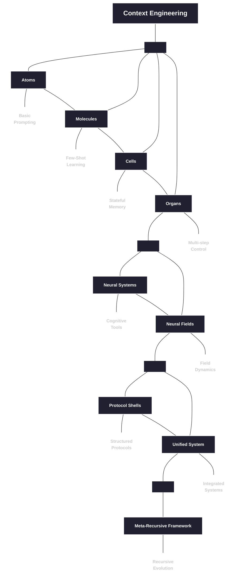

# Foundations

> _From atoms to unified fields: The theoretical backbone of context engineering_
>
>
> **“Order emerges from the interactions of chaos.”
— Ilya Prigogine**

## [Learn to Visualize Context as Semantic Networks and Fields](https://claude.ai/public/artifacts/6a078ba1-7941-43ef-aab1-bad800a3e10c)

## Overview

The `00_foundations` directory contains the core theoretical foundations of context engineering, progressing from basic prompting concepts to advanced unified field theory. Each module builds on the previous ones, creating a comprehensive framework for understanding and manipulating context in large language models.

```
                    Neural Fields
                         ▲
                         │
                    ┌────┴────┐
                    │         │
              ┌─────┴─┐     ┌─┴─────┐
              │       │     │       │
        ┌─────┴─┐   ┌─┴─────┴─┐   ┌─┴─────┐
        │       │   │         │   │       │
   ┌────┴───┐ ┌─┴───┴──┐ ┌────┴───┴┐ ┌────┴───┐
   │Atoms   │ │Molecules│ │Cells    │ │Organs  │
   └────────┘ └─────────┘ └─────────┘ └────────┘
      Basic     Few-shot    Stateful    Multi-step
    Prompting    Learning    Memory      Control
```


## Biological Metaphor

Our approach is structured around a biological metaphor that provides an intuitive framework for understanding the increasing complexity of context engineering:

| Level | Metaphor | Context Engineering Concept |
|-------|----------|------------------------------|
| 1 | **Atoms** | Basic instructions and prompts |
| 2 | **Molecules** | Few-shot examples and demonstrations |
| 3 | **Cells** | Stateful memory and conversation |
| 4 | **Organs** | Multi-step applications and workflows |
| 5 | **Neural Systems** | Cognitive tools and mental models |
| 6 | **Neural Fields** | Continuous semantic landscapes |

As we progress through these levels, we move from discrete, static approaches to more continuous, dynamic, and emergent systems.

## Module Progression

### Biological Foundation (Atoms → Organs)

1. [**01_atoms_prompting.md**](./01_atoms_prompting.md)
   - Basic prompting techniques
   - Atomic instructions and constraints
   - Direct prompt engineering

2. [**02_molecules_context.md**](./02_molecules_context.md)
   - Few-shot learning
   - Demonstrations and examples
   - Context windows and formatting

3. [**03_cells_memory.md**](./03_cells_memory.md)
   - Conversation state
   - Memory mechanisms
   - Information persistence

4. [**04_organs_applications.md**](./04_organs_applications.md)
   - Multi-step workflows
   - Control flow and orchestration
   - Complex applications

### Cognitive Extensions

5. [**05_cognitive_tools.md**](./05_cognitive_tools.md)
   - Mental models and frameworks
   - Reasoning patterns
   - Structured thinking

6. [**06_advanced_applications.md**](./06_advanced_applications.md)
   - Real-world implementation strategies
   - Domain-specific applications
   - Integration patterns

7. [**07_prompt_programming.md**](./07_prompt_programming.md)
   - Code-like prompt structures
   - Algorithmic thinking in prompts
   - Structured reasoning

### Field Theory Foundation

8. [**08_neural_fields_foundations.md**](./08_neural_fields_foundations.md)
   - Context as continuous field
   - Field properties and dynamics
   - Vector space representations

9. [**09_persistence_and_resonance.md**](./09_persistence_and_resonance.md)
   - Semantic persistence mechanisms
   - Resonance between semantic patterns
   - Field stability and evolution

10. [**10_field_orchestration.md**](./10_field_orchestration.md)
    - Coordinating multiple fields
    - Field interactions and boundaries
    - Complex field architectures

### Advanced Theoretical Framework

11. [**11_emergence_and_attractor_dynamics.md**](./11_emergence_and_attractor_dynamics.md)
    - Emergent properties in context fields
    - Attractor formation and evolution
    - Self-organization in semantic spaces

12. [**12_symbolic_mechanisms.md**](./12_symbolic_mechanisms.md)
    - Emergent symbolic processing in LLMs
    - Symbol abstraction and induction
    - Mechanistic interpretability

13. [**13_quantum_semantics.md**](./13_quantum_semantics.md)
    - Observer-dependent meaning
    - Non-classical contextuality
    - Quantum-inspired semantic models

14. [**14_unified_field_theory.md**](./14_unified_field_theory.md)
    - Integration of field, symbolic, and quantum perspectives
    - Multi-perspective problem solving
    - Unified framework for context engineering

## Visual Learning Path

```
┌─────────────────────────────────────────────────────────────────────────┐
│                                                                         │
│  FOUNDATIONS                        FIELD THEORY            UNIFICATION │
│                                                                         │
│  ┌───────┐ ┌───────┐ ┌───────┐     ┌───────┐ ┌───────┐     ┌───────┐   │
│  │Atoms  │ │Cells  │ │Cogni- │     │Neural │ │Emerge-│     │Unified│   │
│  │Mole-  │ │Organs │ │tive   │     │Fields │ │nce &  │     │Field  │   │
│  │cules  │ │       │ │Tools  │     │       │ │Attr.  │     │Theory │   │
│  └───┬───┘ └───┬───┘ └───┬───┘     └───┬───┘ └───┬───┘     └───┬───┘   │
│      │         │         │             │         │             │       │
│      │         │         │             │         │             │       │
│      ▼         ▼         ▼             ▼         ▼             ▼       │
│  ┌─────────────────────────┐       ┌───────────────────┐   ┌─────────┐ │
│  │                         │       │                   │   │         │ │
│  │  Traditional Context    │       │  Field-Based      │   │ Unified │ │
│  │      Engineering        │       │  Approaches       │   │Framework│ │
│  │                         │       │                   │   │         │ │
│  └─────────────────────────┘       └───────────────────┘   └─────────┘ │
│                                                                         │
└─────────────────────────────────────────────────────────────────────────┘
```

## Theoretical Perspectives

Our foundation modules approach context engineering from three complementary perspectives:

```
                        ┌─────────────────┐
                        │                 │
                        │  FIELD VIEW     │
                        │  (Continuous)   │
                        │                 │
                        └─────────┬───────┘
                                  │
                                  │
                    ┌─────────────┴─────────────┐
                    │                           │
       ┌────────────┴────────────┐   ┌──────────┴───────────┐
       │                         │   │                      │
       │   SYMBOLIC VIEW         │   │   QUANTUM VIEW       │
       │   (Mechanistic)         │   │   (Observer-Based)   │
       │                         │   │                      │
       └─────────────────────────┘   └──────────────────────┘
```

### Field Perspective
Views context as a continuous semantic landscape with:
- **Attractors**: Stable semantic configurations
- **Resonance**: Reinforcement between patterns
- **Persistence**: Durability of structures over time
- **Boundaries**: Interfaces between semantic regions

### Symbolic Perspective
Reveals how LLMs implement symbol processing through:
- **Symbol Abstraction**: Converting tokens to abstract variables
- **Symbolic Induction**: Recognizing patterns over variables
- **Retrieval**: Mapping variables back to concrete tokens

### Quantum Perspective
Models meaning as quantum-like phenomena with:
- **Superposition**: Multiple potential meanings simultaneously
- **Measurement**: Interpretation "collapses" the superposition
- **Non-Commutativity**: Order of context operations matters
- **Contextuality**: Non-classical correlations in meaning

## Key Concepts Map

```
                                ┌──────────────────┐
                                │                  │
                                │  Context Field   │
                                │                  │
                                └────────┬─────────┘
                                         │
                 ┌────────────────┬──────┴───────┬────────────────┐
                 │                │              │                │
        ┌────────┴────────┐ ┌─────┴─────┐ ┌──────┴──────┐ ┌───────┴───────┐
        │                 │ │           │ │             │ │               │
        │    Resonance    │ │Persistence│ │  Attractors │ │  Boundaries   │
        │                 │ │           │ │             │ │               │
        └─────────────────┘ └───────────┘ └─────────────┘ └───────────────┘
                                          │
                                 ┌────────┴──────────┐
                                 │                   │
                       ┌─────────┴──────┐   ┌────────┴──────────┐
                       │                │   │                   │
                       │    Emergence   │   │ Symbolic Mechanisms│
                       │                │   │                   │
                       └────────────────┘   └───────────────────┘
                                                      │
                                           ┌──────────┴──────────┐
                                           │                     │
                                  ┌────────┴────────┐   ┌────────┴─────────┐
                                  │                 │   │                  │
                                  │    Abstraction  │   │     Induction    │
                                  │                 │   │                  │
                                  └─────────────────┘   └──────────────────┘
```

## Learning Approach

Each module follows these teaching principles:

1. **Multi-perspective learning**: Concepts are presented from concrete, numeric, and abstract perspectives
2. **Intuition-first**: Physical analogies and visualizations build intuition before formal definitions
3. **Progressive complexity**: Each module builds on previous ones, gradually increasing in sophistication
4. **Practical grounding**: Theoretical concepts are connected to practical implementations
5. **Socratic questioning**: Reflective questions encourage deeper understanding

## Reading Order

For newcomers, we recommend following the numerical order of the modules (01 → 14). However, different paths are possible based on your interests:

### For Prompt Engineers
1 → 2 → 3 → 4 → 7 → 5

### For Field Theory Enthusiasts
8 → 9 → 10 → 11 → 14

### For Symbolic Mechanism Fans
12 → 13 → 14

### For Complete Understanding
Follow the full sequence from 1 to 14

## Integration with Other Directories

The theoretical foundations in this directory support the practical implementations in the rest of the repository:

- **10_guides_zero_to_hero**: Practical notebooks implementing these concepts
- **20_templates**: Reusable components based on these foundations
- **30_examples**: Real-world applications of these principles
- **40_reference**: Detailed reference materials expanding on these concepts
- **60_protocols**: Protocol shells implementing field theory concepts
- **70_agents**: Agent implementations leveraging these foundations
- **80_field_integration**: Complete systems integrating all theoretical approaches

## Next Steps

After exploring these foundations, we recommend:

1. Try the practical notebooks in `10_guides_zero_to_hero/`
2. Experiment with the templates in `20_templates/`
3. Study the complete examples in `30_examples/`
4. Explore the protocol shells in `60_protocols/`

## Field-Based Learning Visualization

```
                        CONTEXT FIELD MAP
            ┌─────────────────────────────────────────┐
            │                                         │
            │    ◎                                    │
            │   Atoms                       ◎         │
            │                            Unified      │
            │                             Field       │
            │                                         │
            │         ◎                               │
            │      Molecules       ◎                  │
            │                  Quantum                │
            │                 Semantics               │
            │                                         │
            │   ◎                                     │
            │  Cells          ◎        ◎              │
            │             Attractors  Symbolic        │
            │                         Mechanisms      │
            │                                         │
            │       ◎                                 │
            │     Organs     ◎                        │
            │              Fields                     │
            │                                         │
            └─────────────────────────────────────────┘
               Attractors in the Learning Landscape
```

Each concept in our framework acts as an attractor in the semantic landscape, guiding your understanding toward stable, coherent interpretations of context engineering.

---

*"The most incomprehensible thing about the world is that it is comprehensible."*
— Albert Einstein
