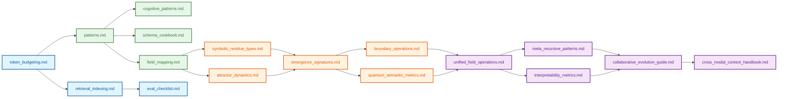

# Context Engineering: Reference Documentation

> "We dissect nature along lines laid down by our native language."
>
> [**— Benjamin Lee Whorf**](https://en.wikipedia.org/wiki/Benjamin_Lee_Whorf), proposer of the [**Sapir-Whorf Linguistic Relativity Hypothesis**](https://en.wikipedia.org/wiki/Linguistic_relativity)
> 
> 
> The concept that language influences thought, not the other way around
>
> Especially relevant in our field of Context Engineering, guiding Agentic thought

## Overview

Welcome to the Reference Documentation section of the Context Engineering repository. This directory contains comprehensive guides, taxonomies, and technical specifications that serve as the theoretical foundation and practical reference for context engineering practices.

These reference materials are designed to complement the more hands-on guides found in the `10_guides_zero_to_hero` and `30_examples` directories, providing deeper insight into the underlying concepts, patterns, and frameworks.

```
┌─────────────────────────────────────────────────────────┐
│                REFERENCE ARCHITECTURE                   │
├─────────────────────────────────────────────────────────┤
│                                                         │
│  FOUNDATIONS → PATTERNS → PHENOMENA → APPLICATIONS      │
│  (Concepts)    (Methods)   (Effects)    (Use Cases)     │
│                                                         │
│  • Understanding the underlying theory                  │
│  • Building a common vocabulary                         │
│  • Establishing evaluation frameworks                   │
│  • Documenting field consensus and open questions       │
│  • Providing design patterns and best practices         │
│                                                         │
└─────────────────────────────────────────────────────────┘
```

## How to Use This Directory

The reference documentation is organized into four main categories to support different learning and application needs:

1. **Foundational Concepts**: Core principles and frameworks that underpin context engineering
2. **Practical Patterns**: Design patterns, schemas, and methodologies for implementation
3. **Emergent Phenomena**: Documentation of complex emergent properties in context systems
4. **Integration Frameworks**: Guides for combining approaches into comprehensive systems

### Learning Path

For those new to context engineering, we recommend the following learning path:



## Directory Contents

### Foundational Concepts

| Document | Description | Key Applications |
|----------|-------------|------------------|
| **[token_budgeting.md](./token_budgeting.md)** | Comprehensive guide to optimizing token usage through resource allocation strategies | Budget planning, cost optimization, context window management |
| **[retrieval_indexing.md](./retrieval_indexing.md)** | Reference for information retrieval systems and indexing methodologies | RAG implementations, knowledge base design, retrieval optimization |
| **[eval_checklist.md](./eval_checklist.md)** | Evaluation methodology and criteria for context engineering systems | Quality assessment, performance measurement, system validation |

### Practical Patterns

| Document | Description | Key Applications |
|----------|-------------|------------------|
| **[patterns.md](./patterns.md)** | General design patterns for context engineering systems | Architecture design, solution development, pattern recognition |
| **[cognitive_patterns.md](./cognitive_patterns.md)** | Library of reasoning patterns for enhancing AI cognitive capabilities | Reasoning enhancement, cognitive scaffolding, problem-solving frameworks |
| **[schema_cookbook.md](./schema_cookbook.md)** | Collection of schema design patterns for structured information representation | Data modeling, knowledge representation, information organization |

### Emergent Phenomena

| Document | Description | Key Applications |
|----------|-------------|------------------|
| **[field_mapping.md](./field_mapping.md)** | Guide to visualizing and understanding semantic fields | Field theory applications, semantic space navigation, conceptual mapping |
| **[symbolic_residue_types.md](./symbolic_residue_types.md)** | Taxonomy of symbolic residues and their classification | Reasoning analysis, bias detection, interpretability research |
| **[attractor_dynamics.md](./attractor_dynamics.md)** | Reference for attractor behavior and dynamics in context systems | Attractor design, stability engineering, semantic gravity control |
| **[emergence_signatures.md](./emergence_signatures.md)** | Guide to recognizing and working with emergent patterns | Emergent property detection, complex system analysis, unpredictable behavior management |
| **[boundary_operations.md](./boundary_operations.md)** | Reference for managing boundaries in semantic fields | Field containment, context isolation, boundary permeability control |

### Integration Frameworks

| Document | Description | Key Applications |
|----------|-------------|------------------|
| **[quantum_semantic_metrics.md](./quantum_semantic_metrics.md)** | Metrics for observer-dependent semantic interpretation | Multi-perspective analysis, ambiguity measurement, interpretive framework design |
| **[unified_field_operations.md](./unified_field_operations.md)** | Guide to integrated field operations across multiple domains | Cross-domain integration, holistic system design, field harmonization |
| **[meta_recursive_patterns.md](./meta_recursive_patterns.md)** | Patterns for self-improving and recursive systems | Self-optimization, recursive enhancement, meta-cognitive frameworks |
| **[interpretability_metrics.md](./interpretability_metrics.md)** | Metrics and methodologies for system transparency | Transparency measurement, interpretability assessment, explainability frameworks |
| **[collaborative_evolution_guide.md](./collaborative_evolution_guide.md)** | Guide to human-AI collaborative development | Partnership design, co-evolution frameworks, collaborative intelligence |
| **[cross_modal_context_handbook.md](./cross_modal_context_handbook.md)** | Handbook for multi-modal integration | Cross-modal systems, unified representations, modality bridging |

## Implementation Methodology

The reference materials support a structured implementation methodology:

```
┌─────────────────────────────────────────────────────────┐
│               IMPLEMENTATION WORKFLOW                   │
├─────────────────────────────────────────────────────────┤
│                                                         │
│  1. ANALYZE                                             │
│     ↓                                                   │
│     • Understand system requirements                    │
│     • Define context engineering objectives             │
│     • Identify resource constraints                     │
│                                                         │
│  2. DESIGN                                              │
│     ↓                                                   │
│     • Select appropriate patterns                       │
│     • Define field architecture                         │
│     • Create schema structures                          │
│                                                         │
│  3. IMPLEMENT                                           │
│     ↓                                                   │
│     • Build token budget plan                           │
│     • Develop context structures                        │
│     • Integrate field operations                        │
│                                                         │
│  4. EVALUATE                                            │
│     ↓                                                   │
│     • Apply evaluation checklist                        │
│     • Measure performance metrics                       │
│     • Assess interpretability                           │
│                                                         │
│  5. REFINE                                              │
│     ↓                                                   │
│     • Optimize token allocation                         │
│     • Enhance field dynamics                            │
│     • Implement meta-recursive improvements             │
│                                                         │
└─────────────────────────────────────────────────────────┘
```

## Application Domains

These reference materials support a wide range of application domains:

### Basic Applications

- **Conversational AI**: Enhance coherence, memory, and reasoning in dialogue systems
- **RAG Systems**: Optimize retrieval and integration of external knowledge
- **Content Generation**: Improve quality, style, and coherence of generated content
- **Domain Adaptation**: Tailor models to specific domains with minimal fine-tuning

### Advanced Applications

- **Multi-Agent Systems**: Design and orchestrate complex agent interactions
- **Emergent Behavior Control**: Manage and harness emergent properties
- **Field-Based Reasoning**: Implement sophisticated reasoning frameworks using field theory
- **Self-Evolving Systems**: Create systems that improve through recursive self-modification

## From Theory to Practice

The reference documentation is designed to bridge theory and practice through:

```
┌─────────────────────────────────────────────────────────┐
│               THEORY-PRACTICE BRIDGE                    │
├─────────────────────────────────────────────────────────┤
│                                                         │
│  CONCEPTUAL          │           PRACTICAL              │
│  UNDERSTANDING       │           APPLICATION            │
│                      │                                  │
│  • Field theory  ───────→ • Field visualization tools   │
│                      │                                  │
│  • Attractor     ───────→ • Attractor implementation    │
│    dynamics          │     techniques                   │
│                      │                                  │
│  • Symbolic      ───────→ • Residue detection methods   │
│    residue           │                                  │
│                      │                                  │
│  • Emergence     ───────→ • Emergence management        │
│    patterns          │     approaches                   │
│                      │                                  │
│  • Quantum       ───────→ • Multi-perspective           │
│    semantics         │     interpretability             │
│                      │                                  │
└─────────────────────────────────────────────────────────┘
```

## Contribution Guidelines

This reference directory is designed to grow and evolve with the field of context engineering. Contributions are welcome in the following areas:

- **New Reference Documents**: Additional reference materials for emerging concepts
- **Existing Document Enhancements**: Expansions, clarifications, and updates to existing documents
- **Visual Aids**: Diagrams, charts, and visualizations that enhance understanding
- **Case Studies**: Documented applications of these reference materials to real-world problems
- **Integration Guides**: References for integrating with other frameworks and technologies

Please see the main repository [CONTRIBUTING.md](../../.github/CONTRIBUTING.md) for submission guidelines.

## Future Directions

The reference materials will continue to evolve in several key directions:

1. **Quantitative Metrics**: Development of more precise measurement frameworks
2. **Cross-Modal Integration**: Expanding coverage of multi-modal context engineering
3. **Industry-Specific Guides**: Specialized reference materials for different sectors
4. **Interpretability Frameworks**: Advanced methods for understanding context systems
5. **Formal Verification**: Approaches to formally verify context engineering systems

---

This README provides an overview of the reference materials available in the `40_reference/` directory. For more hands-on guidance, please see the `10_guides_zero_to_hero/` directory, and for practical examples, refer to the `30_examples/` directory.

Remember that context engineering is both an art and a science—these reference materials provide the scientific foundation, but applying them effectively requires practice, experimentation, and creativity.
